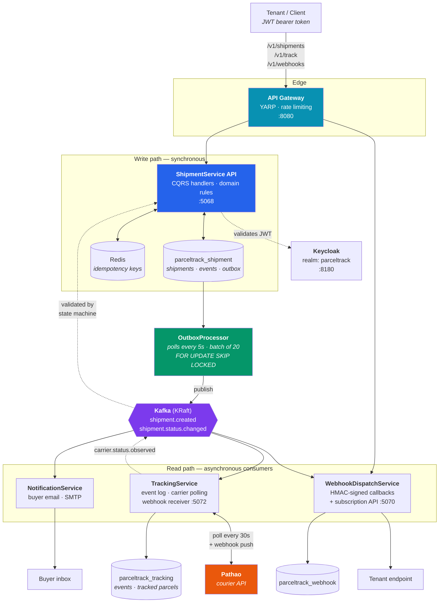
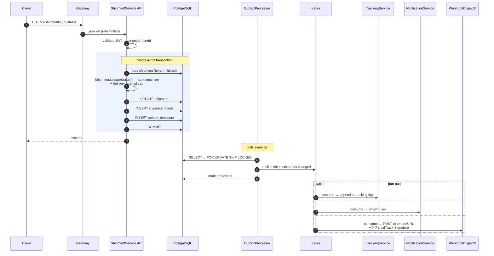
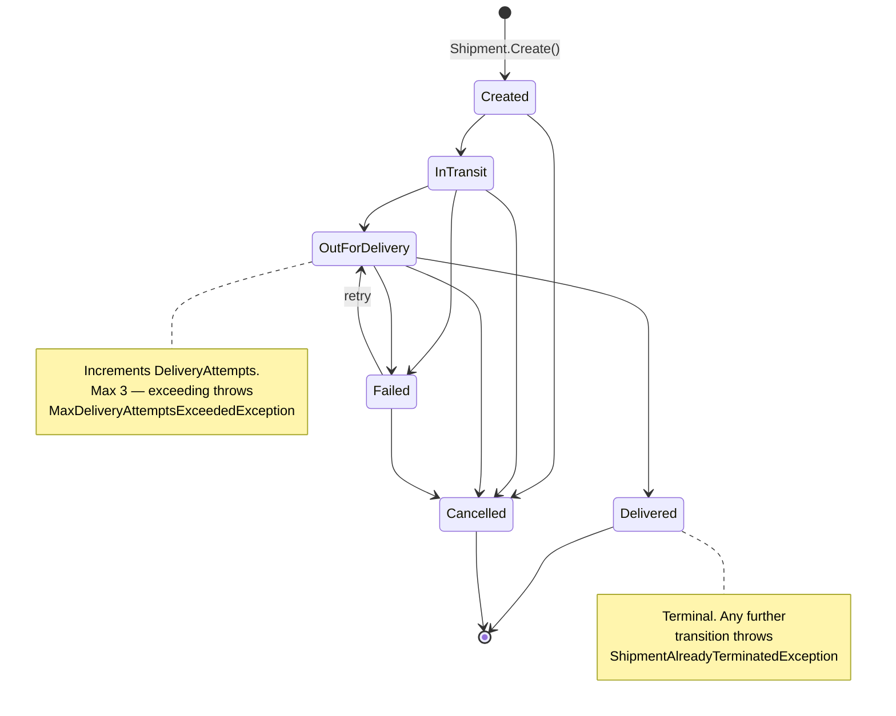
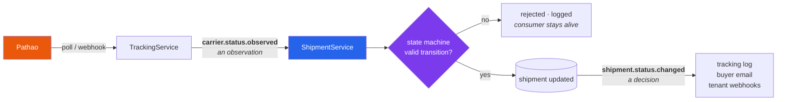

# ParcelTrack

**A multi-tenant, event-driven parcel tracking backend built with .NET 10 microservices.**

ParcelTrack is the infrastructure layer behind shipment visibility for logistics companies and e-commerce platforms. A tenant registers a shipment through a REST API; every subsequent status change fans out asynchronously to an immutable event log, buyer email notifications, and signed outbound webhooks — without the write path ever blocking on any of them.

Built with Clean Architecture, CQRS, Domain-Driven Design, and the Transactional Outbox pattern.

---

## Table of Contents

- [Why this exists](#why-this-exists)
- [Architecture](#architecture)
- [Event flow](#event-flow)
- [Shipment state machine](#shipment-state-machine)
- [Services](#services)
- [Tech stack](#tech-stack)
- [Getting started](#getting-started)
- [Running the services](#running-the-services)
- [API reference](#api-reference)
- [Webhooks](#webhooks)
- [Testing](#testing)
- [Project structure](#project-structure)
- [Design decisions](#design-decisions)
- [Roadmap](#roadmap)

---

## Why this exists

Parcel tracking looks simple until you need it to be correct under load:

- **A status update must never be lost.** If Kafka is down when a parcel is marked delivered, the buyer still has to get the email. ParcelTrack writes events to an outbox table in the *same database transaction* as the status change, then publishes them separately — so a broker outage delays delivery rather than dropping it.
- **Tenants must never see each other's parcels.** Tenant scoping is enforced by an EF Core global query filter at the `DbContext` level, not by remembering to add `WHERE tenant_id = ...` in every query.
- **Retries must not create duplicate shipments.** Clients send an `X-Idempotency-Key`; Redis short-circuits replays.
- **A slow tenant webhook must not slow down the API.** Dispatch happens in a separate worker with its own retry budget.

---

## Architecture



**The key idea:** the API never talks to Kafka. Handlers call `IEventProducer`, which writes a row to `outbox_messages` inside the same transaction as the business change. A background processor drains that table into Kafka. If the broker is unreachable, rows accumulate and retry — up to 5 attempts, after which they dead-letter rather than spin forever.

---

## Event flow

What actually happens when a courier marks a parcel out for delivery:



The client gets its `200 OK` as soon as the transaction commits. Everything downstream is eventually consistent — and independently retryable.

---

## Shipment state machine

Transitions are enforced inside the `Shipment` aggregate. There is no public `Status` setter; an illegal transition throws `InvalidShipmentStatusTransitionException`.



| Rule | Enforcement |
|---|---|
| Creation only via `Shipment.Create(...)` | Private constructor |
| `MaxDeliveryAttempts = 3` | `MaxDeliveryAttemptsExceededException` |
| `Delivered` / `Cancelled` are terminal | `ShipmentAlreadyTerminatedException` |
| Tracking numbers unique per tenant | `DuplicateTrackingNumberException` |
| `TenantId` / `UserId` come from JWT only | Never bound from request body |

---

## Services

| Service | Type | Port | Responsibility |
|---|---|---|---|
| **Gateway** | ASP.NET Core (YARP) | 8080 | Single entry point, routing, fixed-window rate limiting (100 req/min → 429) |
| **ShipmentService** | Web API | 5068 | Shipment lifecycle, domain rules, outbox writes, public tracking lookup |
| **TrackingService** | Worker + API | 5072 | Consumes both topics, appends to an immutable tracking log, **polls couriers for status**, receives courier webhook pushes |
| **NotificationService** | Worker | — | Consumes status changes, emails the buyer via SMTP (MailKit) |
| **WebhookDispatchService** | Worker + API | 5070 | Consumes status changes, delivers HMAC-signed webhooks; also serves subscription CRUD |

### Kafka topics

| Topic | Partitions | Producer | Consumers |
|---|---|---|---|
| `shipment.created` | 3 | ShipmentService | Tracking |
| `shipment.status.changed` | 3 | ShipmentService | Tracking, Notification, Webhook |
| `carrier.status.observed` | 3 | TrackingService | ShipmentService |
| `notification.failed` | 1 | Notification | *(dead letter)* |
| `webhook.failed` | 1 | Webhook | *(dead letter)* |

### Carrier integrations

Couriers are reached through `ICarrierAdapter`, one implementation per courier. The interface covers both directions status can arrive from — polling (`GetStatusAsync`) and webhook push (`ParseWebhookPayload`) — so the rest of the system never learns which mechanism delivered an update, or which courier it came from.

| Courier | Status | Auth | Webhooks |
|---|---|---|---|
| **Pathao** | ✅ Implemented, verified against live sandbox | OAuth2 (token cached, refreshed early, re-auth on 401) | Yes — `POST /webhooks/pathao` |
| Steadfast | Planned | API key + secret | Yes |
| Redx | Planned | API key | No — polling only |

Each courier names its states differently, so adapters translate into ParcelTrack's own `CarrierStatus` vocabulary. Pathao's `Assigned_for_Delivery` and a hypothetical `assigned-for-delivery` both normalise to `OutForDelivery`; an unrecognised status maps to `Unknown` and is logged with the raw value rather than throwing, so a courier inventing a new state can never take the poller down.

Resilience lives in the HttpClient pipeline rather than inside adapters — a 10s per-attempt timeout inside 3 exponential-backoff retries, wrapped in a circuit breaker that opens at a 50% failure ratio and stays open for 30s. No adapter can forget it, and every future courier inherits it.

**How status actually arrives.** Two routes, one code path:

- **Polling** — `CarrierPollingWorker` runs every 30s, takes up to 50 active parcels per carrier oldest-polled-first, and asks the courier. Fair ordering means that with more parcels than one cycle covers, every parcel still gets its turn.
- **Webhook push** — couriers `POST /webhooks/{carrier}` the moment a parcel moves, guarded by a shared secret compared in constant time.

Both feed `CarrierObservationApplier`, so change detection lives in exactly one place. That is what makes running both safe: whichever route sees a change first publishes `shipment.status.changed`, and the other finds nothing new to report. Polling stays on as the safety net — pushes get lost, and Redx cannot push at all.

Only *changes* are published. A courier answers with the same status on nearly every cycle; without that guard the buyer would be emailed every 30 seconds.

**Sandbox:** Pathao publishes working sandbox credentials, so this adapter runs without a merchant account. They are in `appsettings.Development.json`; production credentials belong in environment variables. Polling is off by default in the containerised stack (`POLLING_ENABLED`) — it stays off until credentials exist.

---

## Tech stack

| Concern | Choice |
|---|---|
| Runtime | .NET 10 |
| API | ASP.NET Core, controller-based |
| ORM | EF Core 10 + Npgsql, snake_case naming |
| Database | PostgreSQL (one database per service) |
| Messaging | Confluent.Kafka 2.13 — KRaft mode, no Zookeeper |
| Cache | Redis 7 |
| Auth | Keycloak 24 — JWT bearer, realm `parceltrack` |
| Gateway | YARP |
| Mapping | Mapster |
| Email | MailKit |
| Docs | Scalar (served at `/`) |
| Logging | Serilog (structured) |
| Tracing | OpenTelemetry |
| Tests | xUnit, NSubstitute, Testcontainers |

---

## Getting started

### Prerequisites

- **.NET 10 SDK**
- **PostgreSQL** — runs natively, *not* in Docker
- **Docker Desktop** — for Redis, Kafka, and Keycloak

### 1. Create the databases

```sql
CREATE DATABASE parceltrack_shipment;
CREATE DATABASE parceltrack_notification;
CREATE DATABASE parceltrack_tracking;
CREATE DATABASE parceltrack_webhook;
CREATE DATABASE parceltrack_keycloak;
```

### 2. Create a `.env` at the repo root

Not committed. Generate the Kafka cluster ID with `docker run --rm confluentinc/cp-kafka:7.6.0 kafka-storage random-uuid`.

```dotenv
REDIS_PASSWORD=your_redis_password
POSTGRES_USER=postgres
POSTGRES_PASSWORD=your_postgres_password
KEYCLOAK_ADMIN_USER=admin
KEYCLOAK_ADMIN_PASSWORD=your_admin_password
KAFKA_CLUSTER_ID=your_generated_cluster_id

# Optional — NotificationService falls back to console logging without these
SMTP_HOST=smtp.example.com
SMTP_PORT=587
SMTP_USERNAME=
SMTP_PASSWORD=
SMTP_FROM=noreply@parceltrack.io
```

### 3. Start infrastructure

```powershell
# Redis + Kafka (topics are auto-created by a one-shot init container)
docker-compose --profile messaging up -d

# Add Keycloak — imports the parceltrack realm on first boot
docker-compose --profile messaging --profile auth up -d
```

Keycloak admin console: `http://localhost:8180`. The imported realm ships with clients `parceltrack-api` and `parceltrack-frontend`, roles `user` / `business` / `admin` / `tenant-admin`, and test users.

> **Note:** JWTs must carry a `tenantId` claim — the API rejects tokens without it. The realm's protocol mappers are already configured for this.

### 4. Apply migrations

```powershell
dotnet ef database update `
  --project src/Services/ShipmentService/ParcelTrack.ShipmentService.Infrastructure `
  --startup-project src/Services/ShipmentService/ParcelTrack.ShipmentService.API
```

The Tracking and Webhook workers migrate themselves on startup.

---

## Running the services

### Locally

```powershell
dotnet run --project src/Gateway/ParcelTrack.Gateway
dotnet run --project src/Services/ShipmentService/ParcelTrack.ShipmentService.API
dotnet run --project src/Services/TrackingService/ParcelTrack.TrackingService.Worker
dotnet run --project src/Services/NotificationService/ParcelTrack.NotificationService.Worker
dotnet run --project src/Services/WebhookDispatchService/ParcelTrack.WebhookDispatchService.Worker
```

| Endpoint | URL |
|---|---|
| Gateway | `http://localhost:8080` |
| ShipmentService | `http://localhost:5068` |
| API docs (Scalar) | `http://localhost:5068/` |
| WebhookDispatchService | `http://localhost:5070` |
| Health checks | `/health` on each |

### Fully containerised

```powershell
docker-compose --profile messaging --profile auth --profile app up -d --build
```

Containers reach the host's PostgreSQL via `host.docker.internal`.

---

## API reference

All routes are reachable through the gateway. Everything except public tracking requires `Authorization: Bearer <token>`.

### Shipments — `/v1/shipments`

| Method | Route | Description |
|---|---|---|
| `POST` | `/v1/shipments` | Create a shipment |
| `GET` | `/v1/shipments/{id}` | Get one by ID |
| `GET` | `/v1/shipments?page=1&pageSize=20` | Paged list, tenant-scoped |
| `PUT` | `/v1/shipments/{id}/status` | Transition status |
| `DELETE` | `/v1/shipments/{id}` | Cancel with a reason |
| `GET` | `/v1/shipments/{id}/events` | Full event history |

**Create** — send `X-Idempotency-Key` to make retries safe:

```http
POST /v1/shipments
Authorization: Bearer <token>
X-Idempotency-Key: 7f3c1e88-...
Content-Type: application/json

{
  "trackingNumber": "PT-2026-000123",
  "carrierType": "Pathao",
  "buyerEmail": "buyer@example.com",
  "destinationCity": "Dhaka"
}
```

Carriers: `Steadfast`, `Pathao`, `Redx`. `buyerEmail` is optional — B2B tenants may omit it.

**Update status:**

```http
PUT /v1/shipments/{id}/status

{
  "newStatus": "OutForDelivery",
  "description": "Out with rider",
  "location": "Gulshan Hub"
}
```

`TenantId` and `UserId` are never accepted in a request body — they come from the token.

### Public tracking — `/v1/track` *(anonymous)*

```http
GET /v1/track/PT-2026-000123
```

Returns status and event history without authentication — safe to expose to buyers.

### Webhook subscriptions — `/v1/webhooks`

| Method | Route | Description |
|---|---|---|
| `GET` | `/v1/webhooks` | List this tenant's subscriptions |
| `POST` | `/v1/webhooks` | Register a target URL |
| `DELETE` | `/v1/webhooks/{id}` | Remove a subscription |

---

## Webhooks

Register an endpoint with an optional signing secret:

```http
POST /v1/webhooks

{
  "targetUrl": "https://your-app.example.com/hooks/parceltrack",
  "secret": "whsec_your_shared_secret"
}
```

On every status change, ParcelTrack POSTs the event JSON to your URL. If a secret is set, the request carries:

```
X-ParcelTrack-Signature: sha256=<hex HMAC-SHA256 of the raw body>
```

**Verify it before trusting the payload:**

```csharp
var expected = "sha256=" + Convert.ToHexString(
    HMACSHA256.HashData(
        Encoding.UTF8.GetBytes(secret),
        Encoding.UTF8.GetBytes(rawBody))).ToLowerInvariant();

if (!CryptographicOperations.FixedTimeEquals(
        Encoding.UTF8.GetBytes(expected),
        Encoding.UTF8.GetBytes(receivedSignature)))
{
    return Unauthorized();
}
```

**Delivery semantics:** up to **3 attempts** with exponential backoff (1s, 2s, 4s). Any 2xx counts as success. After three failures the delivery is marked exhausted and published to `webhook.failed`. Every attempt is recorded in `parceltrack_webhook` with status code and error. Return 2xx quickly and process asynchronously.

---

## Testing

```powershell
# Unit tests — 247 across four projects
dotnet test tests/ShipmentService/ParcelTrack.ShipmentService.UnitTests
dotnet test tests/NotificationService/ParcelTrack.NotificationService.UnitTests
dotnet test tests/TrackingService/ParcelTrack.TrackingService.UnitTests
dotnet test tests/WebhookDispatchService/ParcelTrack.WebhookDispatchService.UnitTests

# Integration tests — spins up real PostgreSQL via Testcontainers, needs Docker
dotnet test tests/ShipmentService/ParcelTrack.ShipmentService.IntegrationTests
```

| Suite | Tests | Covers |
|---|---|---|
| ShipmentService.UnitTests | 86 | Domain state machine, delivery caps, all handlers, carrier observation validation |
| WebhookDispatchService.UnitTests | 35 | Signing, retry/backoff, subscription rules |
| NotificationService.UnitTests | 17 | Both event handlers, templating |
| TrackingService.UnitTests | 109 | Records, handlers, Pathao adapter/token/status mapping, polling + webhook ingest |
| ShipmentService.IntegrationTests | 8 | Full HTTP → DB round trips against real Postgres |

**Testing it by hand:** [`docs/MANUAL-TESTING.md`](docs/MANUAL-TESTING.md) walks the full loop end to end — create a shipment, play the courier against the webhook endpoint, and watch the observation travel through Kafka, get validated by the state machine, and come back out as an email. It includes the cases that should *fail*: impossible transitions, repeated statuses, and cross-tenant access.

**Integration tests never mock the database.** They run against a real PostgreSQL container — an in-memory provider would not catch the query filters and constraints they exist to verify.

CI runs the build, all unit suites, the integration suite, and a Docker build of all five images on every push to `main`, `develop`, and `feat/**`.

---

## Project structure

```
src/
  Gateway/
    ParcelTrack.Gateway/                     # YARP reverse proxy
  Services/
    ShipmentService/                         # Full 4-layer Clean Architecture
      ...API/                                # Controllers, middleware, DI, Program.cs
      ...Application/                        # Commands, queries, handlers, DTOs
      ...Domain/                             # Entities, enums, domain exceptions
      ...Infrastructure/                     # EF Core, Kafka, outbox, Redis
    TrackingService/                         # Domain / Application / Infrastructure / Worker
    NotificationService/                     # Application / Worker
    WebhookDispatchService/                  # Single project — worker + subscription API
  Shared/
    ParcelTrack.Shared.Common/               # ApiErrorResponse, PagedResult<T>
    ParcelTrack.Shared.Contracts/            # Kafka topics + event records
tests/                                       # One suite per service
Keycloak/parceltrack-realm.json              # Auto-imported realm
docker-compose.yml                           # Profiles: messaging · auth · app
```

Dependencies point inward only: `Domain ← Application ← Infrastructure ← API`.

---

## Design decisions

**CQRS without MediatR.** Handlers are plain scoped classes injected straight into controllers. No `IRequestHandler<,>`, no pipeline behaviours, no reflection-based dispatch — one less abstraction between a request and the code that serves it, and a stack trace that reads honestly.

**Outbox over direct publishing.** Publishing to Kafka inside a request handler means a broker hiccup either loses the event or fails a write that already succeeded. The outbox makes the event part of the same transaction as the data change.

**`FOR UPDATE SKIP LOCKED`.** Lets multiple API instances run the outbox processor concurrently — each grabs a disjoint batch instead of contending on the same rows.

**Global query filter for tenancy.** Scoping lives in `ShipmentDbContext`, so a forgotten `WHERE` clause cannot leak another tenant's parcels.

**One database per service.** No cross-service joins, no shared schema, no coupled migrations.

**Idempotency at the edge.** Redis-backed, keyed off a client-supplied header — network retries stop becoming duplicate parcels.

---

## Observations vs. decisions

Two event types that look similar and are deliberately not:

| | `carrier.status.observed` | `shipment.status.changed` |
|---|---|---|
| Meaning | A courier *claims* something happened | ParcelTrack *decided* something is true |
| Published by | TrackingService (polling or webhook) | ShipmentService, after validation |
| Trustworthy? | No — may be impossible, stale, or repeated | Yes — passed the state machine |
| Consumed by | ShipmentService | Tracking log, notifications, webhooks |

A courier observation is not allowed to change a shipment directly. It goes through the same `UpdateShipmentStatusCommandHandler` an API call would, so the state machine, the delivery-attempt cap, and the outbox all apply — a courier claiming a brand-new parcel is `Delivered` is rejected exactly as a client would be.

Keeping the two apart is also what prevents a loop: if the poller published `shipment.status.changed` directly, ShipmentService would apply it and publish the same event again, forever.



Rejections are logged, never thrown. A Kafka consumer that dies on a message it can never process retries it forever and blocks the partition behind it — an impossible transition is bad data, not a transient fault.

---

## Roadmap

- [ ] OTLP exporter → Jaeger/Tempo (currently console-only)
- [ ] Notification history persistence
- [x] Pathao carrier adapter — OAuth2, normalised status mapping, Polly retry/circuit-breaker/timeout
- [x] Carrier polling worker + webhook receive endpoints
- [x] Propagate courier observations back to ShipmentService, validated through the state machine
- [ ] Steadfast and Redx adapters (need merchant credentials)
- [ ] WebSocket/SignalR push for live buyer tracking
- [ ] Per-tenant rate limit tiers
- [ ] Kubernetes manifests + registry publishing

---

## License

See [LICENSE](LICENSE).
